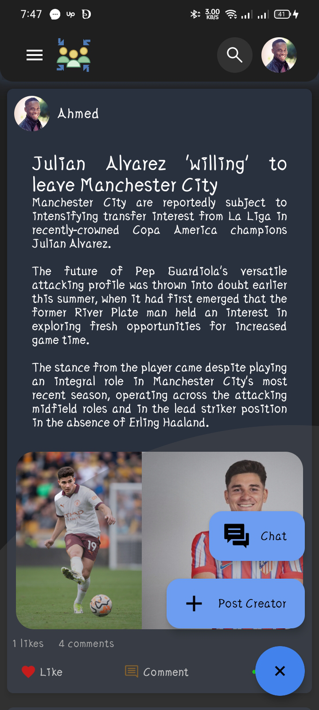

# Sociality Demo

Social Media application built using Kotlin Multiplatform Mobile (KMM) and Supabase. It leverages Supabase's authentication, real-time capabilities, database, and storage to provide a seamless social experience.

## 🔗 Links

Screenshot
-------------

### Android
<!--suppress CheckImageSize -->
<table>
    <tr>
      <td>  </td>
      <td>  </td>
    </tr>
    <tr>
      <td>  </td>
      <td>  </td>
    </tr>
    <tr>
      <td>  </td>
      <td>  </td>
    </tr>
    <tr>
      <td>  </td>
    </tr>
</table>

### IOS
<table>
    <tr>
      <td>  </td>
      <td>  </td>
    </tr>
    <tr>
      <td>  </td>
      <td>  </td>
    </tr>
    <tr>
      <td>  </td>
      <td>  </td>
    </tr>
    <tr>
      <td>  </td>
    </tr>
</table>
