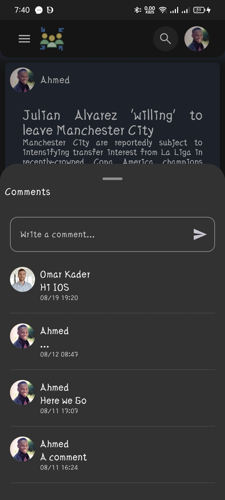

# Sociality Demo

Welcome to **Sociality**, a multi-platform social media mobile application built using Kotlin Multiplatform Mobile (KMM) and Supabase. It leverages Supabase's authentication, real-time capabilities, database, and storage to provide a seamless social experience. This project supports both Android and iOS platforms, providing a seamless social media experience where users can share posts, like, comment, interact with other users' content, and communicate through a built-in messenger.

## Features

- **User Authentication:** Secure login and registration process for users.
- **Home Feed:** Display a list of posts from various users, including text and media content.
- **Post Creation:** Users can create new posts with text and images.
- **Likes & Comments:** Users can like posts and add comments.
- **Profile Management:** Users can update their profile information including their name and profile picture.
- **Real-time Updates:** Posts, likes, and comments are updated in real-time.
- **Messenger:** Real-time chat feature that allows users to send and receive messages instantly.
- **Responsive UI:** Fully responsive design for a seamless experience across different screen sizes.
- **Multi-Platform Support:** Built using KMM, Sociality runs on both Android and iOS.

## Getting Started

### Prerequisites

- **Android Studio Bumblebee** or later
- **Xcode 12** or later for iOS
- **Kotlin 1.5** or later

### Installation

1. **Clone the repository:**
   ```bash
   git clone https://github.com/OmAr-Kader/Sociality.git
   ```
2. **Open the project in Android Studio for Android development, or in Xcode for iOS development.**

3. **Build and run the project:**
    - For Android: Connect your Android device or use an emulator, then press the "Run" button in Android Studio.
    - For iOS: Connect your iOS device or use a simulator, then press the "Run" button in Xcode.


## 🔗 Links & Dependencies

[](https://kotlinlang.org/docs/multiplatform.html)

[](https://developer.android.com/studio?gclsrc=aw.ds)

[](https://developer.apple.com/documentation/xcode)

[](https://developer.apple.com/tutorials/app-dev-training)

[](https://developer.apple.com/xcode/swiftui/)

[](https://www.jetbrains.com/help/kotlin-multiplatform-dev/compose-multiplatform-getting-started.html#join-the-community)

[](https://github.com/InsertKoinIO/koin)

[](https://github.com/Swinject/Swinject)

[](https://github.com/ryohey/Zoomable)

[](https://supabase.com/docs/reference/kotlin/installing)

## Usage

- **Create an Account:** Register with your email and set up your profile.
- **Explore the Feed:** Scroll through the home feed to see posts from other users.
- **Interact with Posts:** Like or comment on posts you find interesting.
- **Create Your Own Posts:** Share your thoughts and images with others.
- **Send Messages:** Use the messenger feature to chat with other users in real-time.

## Project Structure

```plaintext
├── shared
│   └── src/commonMain/kotlin/com/omarkader/sociality
├── androidApp        # Android-specific implementation
├── iosApp            # iOS-specific implementation
```

Screenshot
-------------

### Android
<!--suppress CheckImageSize -->
<table>
    <tr>
      <td>  </td>
      <td>  </td>
    </tr>
    <tr>
      <td>  </td>
      <td>  </td>
    </tr>
    <tr>
      <td>  </td>
      <td>  </td>
    </tr>
    <tr>
      <td>  </td>
    </tr>
</table>

### IOS
<table>
    <tr>
      <td>  </td>
      <td>  </td>
    </tr>
    <tr>
      <td>  </td>
      <td>  </td>
    </tr>
    <tr>
      <td>  </td>
      <td>  </td>
    </tr>
    <tr>
      <td>  </td>
    </tr>
</table>
